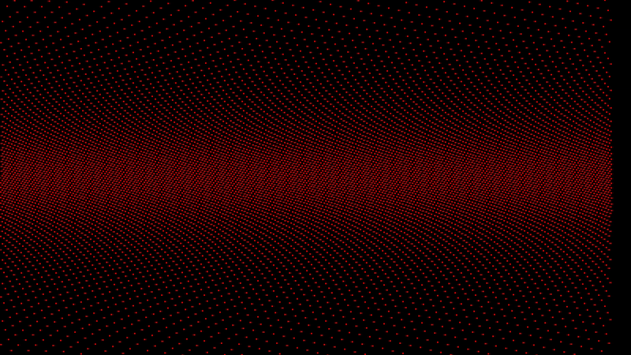

## my_screensaver
> Graphical
>
> Render graphical effects and animations with the CSFML library
>
> 3 weeks, solo project

- [Usage](#usage)
- [Screensavers](#screensavers)

One of the coolest projects to do

Heavily inspired by the coding challenges of the
[Coding train](https://thecodingtrain.com/). Shiffman for President !

### Usage

My program is intended to not be interactive.
It assumes you have a 1920x1080 resolution.

### Screensavers

Below is an exhaustive preview of all my animations :

#### Blizzard

#### Circus circles

#### Rainbow rain

#### Flowers

#### Lorentz Attractor

#### Hamon

#### Laser

#### Random Numbers

#### Digital Clock

#### Ten print

#### Zebra Horizon

#### Building lights

#### Bouncing ball

#### RGB Tan

#### Bubble sort visualization

My favorite animation is the laser one